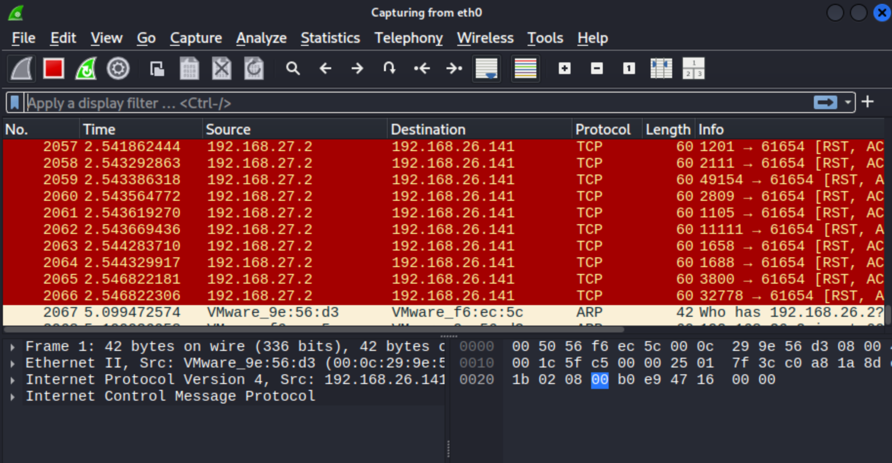

# Домашнее задание к занятию "`Уязвимости и атаки на информационные системы`" - `Решетов Павел`

---

### Задание 1

`Скачайте и установите виртуальную машину Metasploitable: https://sourceforge.net/projects/metasploitable/.

Это типовая ОС для экспериментов в области информационной безопасности, с которой следует начать при анализе уязвимостей.

Просканируйте эту виртуальную машину, используя nmap.

Попробуйте найти уязвимости, которым подвержена эта виртуальная машина.

Сами уязвимости можно поискать на сайте https://www.exploit-db.com/.

Для этого нужно в поиске ввести название сетевой службы, обнаруженной на атакуемой машине, и выбрать подходящие по версии уязвимости.

Ответьте на следующие вопросы:

Какие сетевые службы в ней разрешены?
Какие уязвимости были вами обнаружены? (список со ссылками: достаточно трёх уязвимостей)
Приведите ответ в свободной форме.`

###
Ответ:
1) Разрешенные сетевые службы смотрим утилитой nmap:
-sS 192.168.27.2
  
PORT     STATE SERVICE
21/tcp   open  ftp
22/tcp   open  ssh
23/tcp   open  telnet
25/tcp   open  smtp
53/tcp   open  domain
80/tcp   open  http
111/tcp  open  rpcbind
139/tcp  open  netbios-ssn
445/tcp  open  microsoft-ds
512/tcp  open  exec
513/tcp  open  login
514/tcp  open  shell
1099/tcp open  rmiregistry
1524/tcp open  ingreslock
2049/tcp open  nfs
2121/tcp open  ccproxy-ftp
3306/tcp open  mysql
5432/tcp open  postgresql
5900/tcp open  vnc
6000/tcp open  X11
6667/tcp open  irc
8009/tcp open  ajp13
8180/tcp open  unknown

2) 
1)vsftpd 2.3.4 - Backdoor Command Execution (https://www.exploit-db.com/exploits/49757)
2)ProFTPd IAC 1.3.x - Remote Command Execution (https://www.exploit-db.com/exploits/15449)
3)Apache < 2.2.34 / < 2.4.27 - OPTIONS Memory Leak (https://www.exploit-db.com/exploits/42745)
###

### Задание 2

Задание 2

Проведите сканирование Metasploitable в режимах SYN, FIN, Xmas, UDP.

Запишите сеансы сканирования в Wireshark.

Ответьте на следующие вопросы:

Чем отличаются эти режимы сканирования с точки зрения сетевого трафика?
Как отвечает сервер?
Приведите ответ в свободной форме.`

`При необходимости прикрепитe сюда скриншоты`

`Ответ: 
1)SYN scan (-sS) 
Отправляется SYN-запрос. Если порт открыт, сервер отвечает SYN+ACK. Nmap сразу шлёт RST (не открывая соединение).Если порт закрыт, сервер отвечает RST. Сервер ответчает быстро (не полное соединение).

2)FIN scan (-sF)
Отправляется TCP FIN-запрос. Если порт закрыт, сервер отвечает RST.
Если порт открыт, по RFC сервер должен игнорировать пакет (нет ответа). Закрытый порт отвечает RST.Работает только на системах, которые строго следуют RFC (Linux/Unix), но не на Windows (Windows отвечает RST в любом случае).

3)Xmas scan (-sX)
Поведение такое же, как FIN scan (RST при закрытом порте, тишина при открытом).Отличается только по содержимому TCP-флагов(FIN+PSH+URG), что видно в Wireshark.

4)UDP scan (-sU)
Отправляется пустой UDP-пакет.Если порт закрыт, сервер отвечает ICMP Destination Unreachable. Если порт открыт, обычно нет ответа (UDP без установления соединения). Ответ не очень подробный.
Очень медленные ответы.
`

